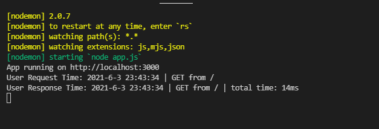

# Express Middleware Practice
練習及了解 Middleware 在請求回應之間如何運作與發生了什麼事情。



## 功能
* 運行時會把資訊記錄到終端機上包括: 時間戳記(以當地時間顯示)、請求HTTP方法及該頁面的URL。
* 運行後會把資訊記錄到終端機上包括: 時間戳記(以當地時間顯示)、請求HTTP方法、該頁面的URL以及整個運行流程所花費的時間。

## 環境建置
* Node.js: v10.15.0
* Express: ^4.17.1

## 專案安裝
1. 下載專案
```
git clone https://github.com/ZinXianY/middleware-practice.git
```

2. 切換存放此專案的資料夾
```
cd middleware-practice
```

3. 安裝npm套件
```
npm install
```

4. 啟動伺服器執行檔案
```
npm run dev
```

5. 出現以下字樣表式啟動成功!
```
APP is running on http://localhost:3000
```